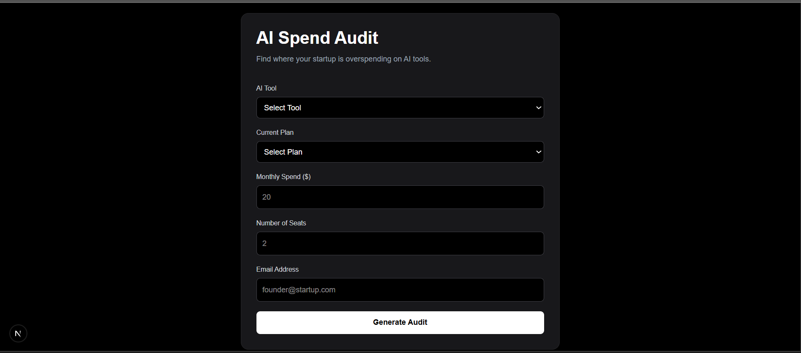
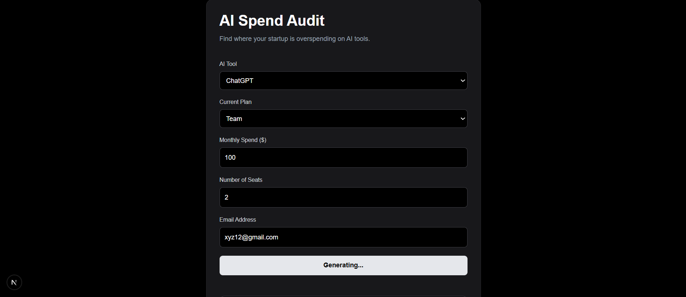
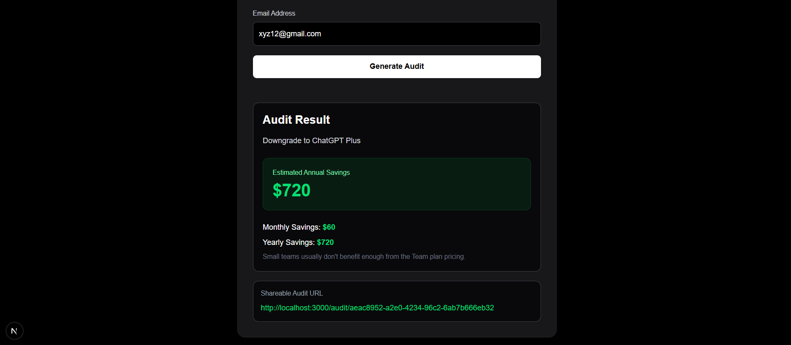

# AI Spend Audit

AI Spend Audit is a SaaS-style web application that helps startups identify unnecessary spending on AI tools and discover cost-saving opportunities.

Built with Next.js, TypeScript, Tailwind CSS, and Supabase.

---

# Live Demo

Deployed on Vercel.

```bash
https://vercel.com/gopikas-projects-d9b21618/ai-spend-audit
```

---

# Features

* AI tool spend analysis
* Smart savings recommendations
* Estimated yearly savings calculation
* Shareable audit reports
* Dynamic audit pages
* Local storage persistence
* Supabase database integration
* Responsive modern UI
* Loading states and validations

---

# Screenshots

## Home Page

Add screenshot like this:

```md

```

## Audit Result

```md

```

## Shared Report

```md

```

---


# Tech Stack

Frontend:

* Next.js 16
* React
* TypeScript
* Tailwind CSS

Backend:

* Supabase

Deployment:

* Vercel

---

# Folder Structure

```bash
app/
 ├── audit/
 │    └── [id]/
 │         └── page.tsx
 ├── globals.css
 ├── layout.tsx
 └── page.tsx

lib/
 ├── auditEngine.ts
 └── supabase.ts

screenshots/

README.md
DEVLOG.md
ARCHITECTURE.md
```

---

# Local Setup

## Clone Repository

```bash
git clone https://github.com/Gopika-s-34/ai-spend-audit.git
```

---

## Install Dependencies

```bash
npm install
```

---

## Run Development Server

```bash
npm run dev
```

---

# Environment Variables

Create:

```bash
.env.local
```

Add:

```env
NEXT_PUBLIC_SUPABASE_URL=your_url
NEXT_PUBLIC_SUPABASE_PUBLISHABLE_KEY=your_key
```

---

# Database

Supabase table:

```sql
audits
```

Columns:

* id
* tool
* plan
* spend
* seats
* recommendation
* savings
* yearly_savings
* email

---

# Testing

Basic audit engine testing added for:

* savings calculation
* overspending detection
* recommendation generation

---

# Challenges Faced

* Configuring Supabase Row Level Security
* Dynamic routing with Next.js App Router
* Managing environment variables
* Creating shareable audit reports

---

# Future Improvements

* Authentication
* Dashboard analytics
* Export reports as PDF
* Charts and visual insights
* AI-generated optimization suggestions

---

# Author

Gopika

GitHub:

```bash
https://github.com/Gopika-s-34
```

---

# License

MIT License
